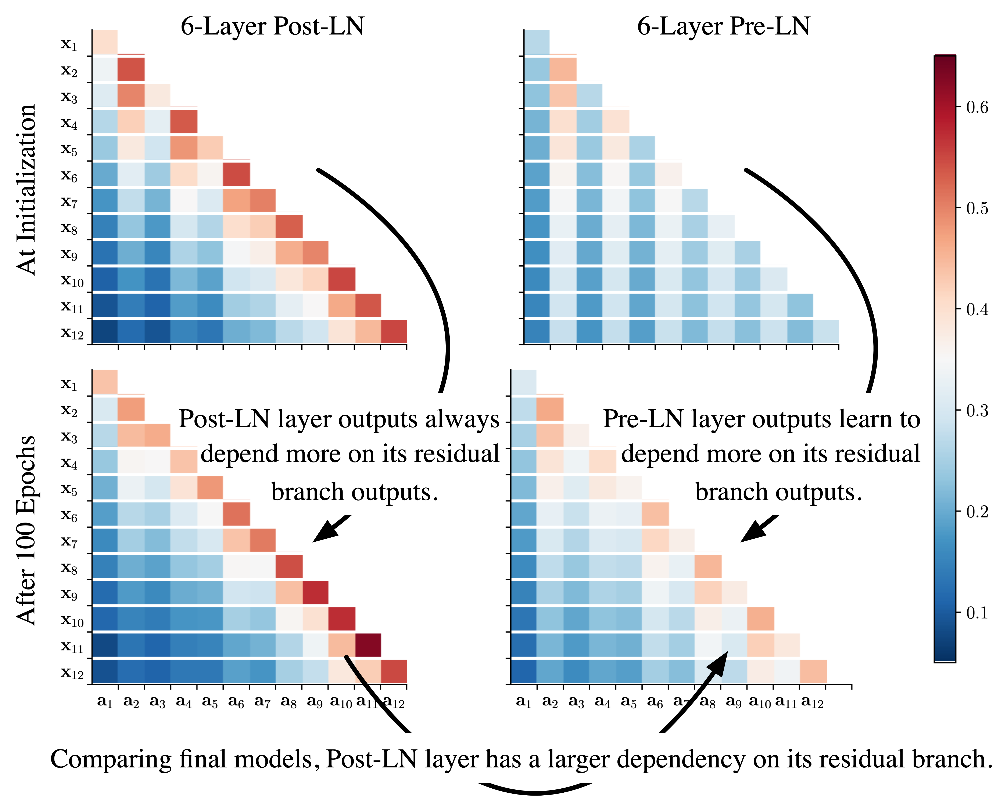
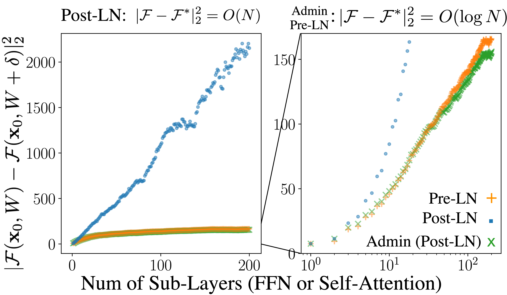

[](https://opensource.org/licenses/Apache-2.0)

<h2 align="center">Admin</h2>
<h5 align="center">Understanding the Difficulty of Training Transformers</h5>

We are in an early-release beta. Expect some adventures and rough edges.

## Table of Contents

- [Introduction](#introduction)
- [Amplification Effect](#dependency-and-amplification-effect)
- [Quick Start](#quick-start-guide)
- [Citation](#citation)

## Introduction
<h5 align="center"><i>What complicates Transformer training?</i></h5>

In our study, we go beyond gradient vanishing and identify an __amplification effect__ that substantially influences Transformer training. 
Specifically, for each layer in a multi-layer Transformer, heavy dependency on its residual branch makes training unstable, yet light dependency leads to sub-optimal performance.

## Dependency and Amplification Effect

Our analysis starts from the observation that Pre-LN is more robust than Post-LN, whereas Post-LN typically leads to a better performance. 
As shown in Figure 1, we find these two variants have different layer dependency patterns. 

<p align="center"></p>

With further exploration, we find that for a N-layer residual network, after updating its parameters W to W\*, its outputs change is proportion to the dependency on residual branches. 

<p align="center"></p>

Intuitively, since a larger output change indicates a more unsmooth loss surface, the large dependency complicates training.
Moreover, we propose Admin (**ad**aptive **m**odel **in**itialization), which starts the training from the area with a smoother surface. 
More details can be found in our [paper](https://arxiv.org/abs/2004.08249).

## Quick Start Guide

Our implementation is based on the fairseq package. Please run the following commands to install:
```
git clone https://github.com/LiyuanLucasLiu/Transforemr-Clinic.git
cd fairseq
pip install --editable .
```
The guidance for reproducing our results is available at:
- [WMT'14 De-En](nmt-experiments/wmt14_en-de.md)
- [WMT'14 De-Fr](nmt-experiments/wmt14_en-fr.md)
- [IWSLT'14 En-De](nmt-experiments/iwslt14_de-en.md)

Specifically, our implementation requires to first set ```--init-type adaptive-profiling``` and use one GPU for this profiling stage, then set ```--init-type adaptive``` and start training.  

## Citation
Please cite the following paper if you found our model useful. Thanks!

>Liyuan Liu, Xiaodong Liu, Jianfeng Gao, Weizhu Chen, and Jiawei Han (2020). Understanding the Difficulty of Training Transformers. arXiv preprint arXiv:2004.08249 (2020).

```
@article{liu2020admin,
  title={Understanding the Difficulty of Training Transformers},
  author = {Liu, Liyuan and Liu, Xiaodong and Gao, Jianfeng and Chen, Weizhu and Han, Jiawei},
  journal={arXiv preprint arXiv:2004.08249},
  year={2020}
}
```
